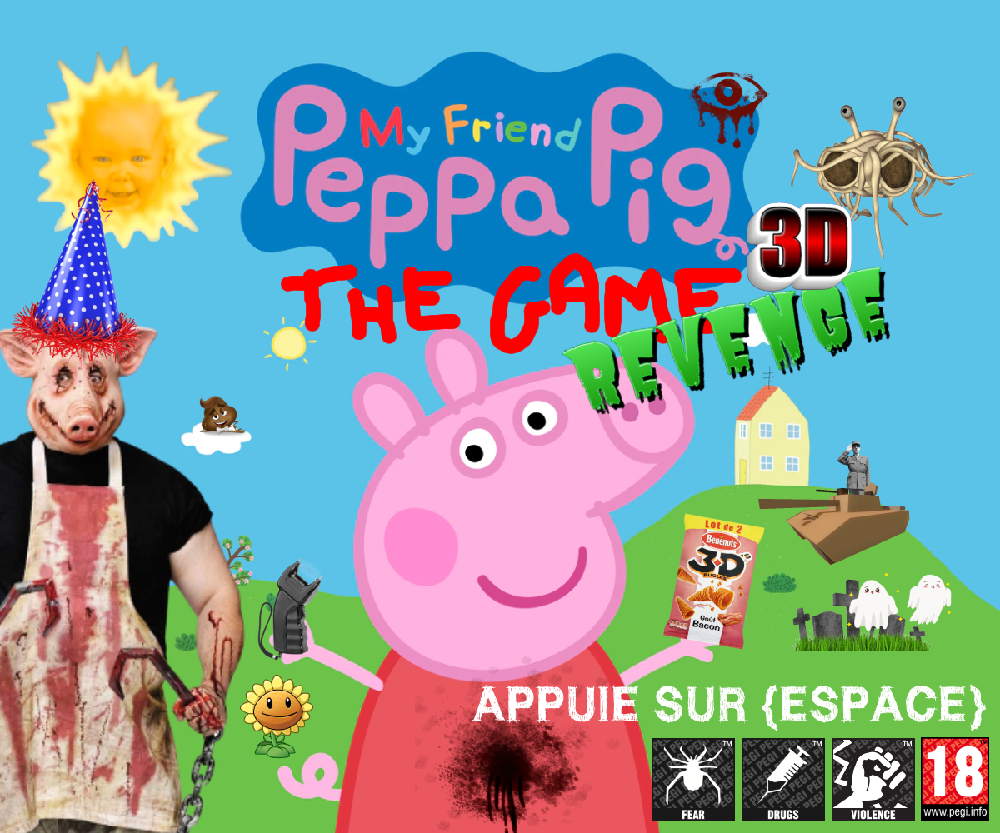
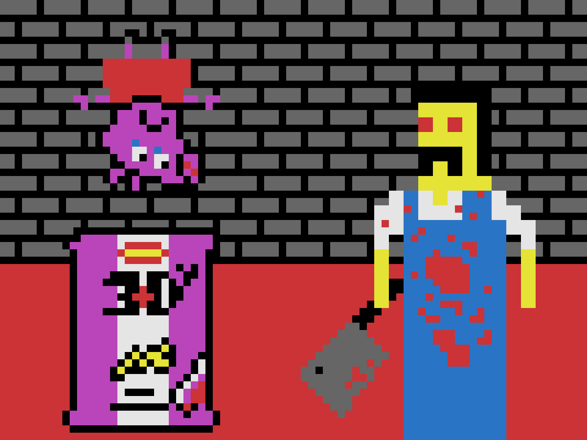
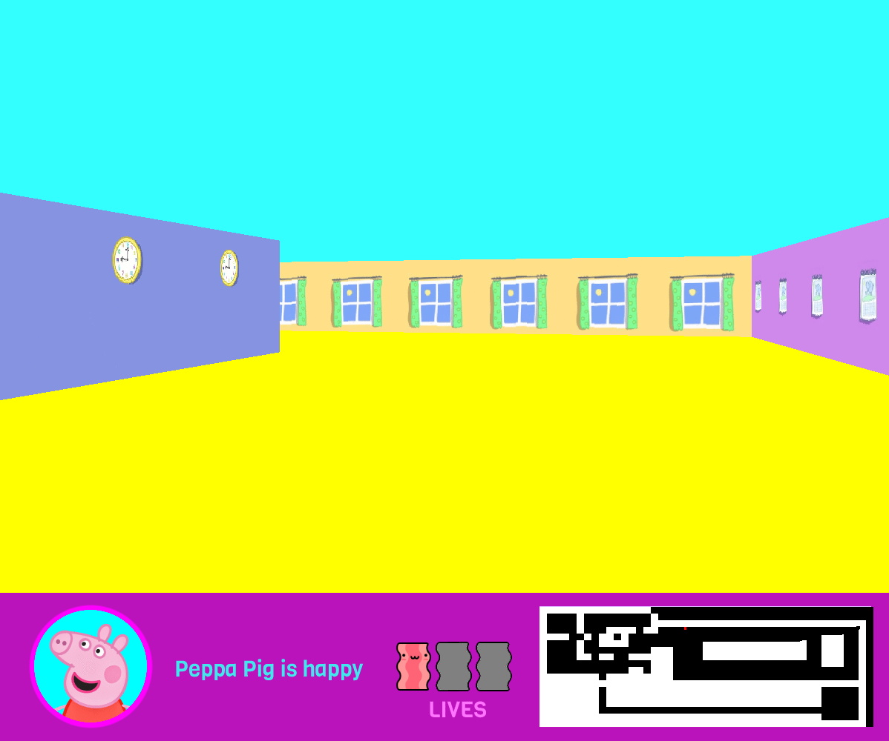

# Les Aventures de Peppa Pig 2 REVENGE LA SUITE 3D - Projet Cub3D 42

```
" I'm Peppa Pig! *Snort* - 🐷 "
```


En etant la suite de [ses precedentes aventures](https://github.com/vietdu91/42_so_long_Les-Aventures-de-Peppa-Pig), Peppa Pig continue a s'amuset et a rigoler, mais cette fois-ci dans son immense maison ! Venez decouvrir son humble demeure ! Toutefois, sans qu'elle sache, sa maison detient un lieu secret ou se cache son predateur, celui qui veut la manger avec sang-froid et subtilite : DYLAN LE BOUCHER !
Le but de ce projet est donc de créer un petit jeu en 3D dans lequel le célèbre personnage, ami de tous les enfants, Peppa Pig
cherche à tout prix de s'en sortir de ce mechant. Vous avez l'entière responsabilité de l'escorter
en securite sans qu'elle puisse rencontrer le méchant et le machiavélique Dylan le Boucher... 

## ⚠️ Avertissement !

Avertissement : ce jeu comporte des scènes, des propos ou des images pouvant heurter la sensibilité des joueuses et des joueurs, malgré que le jeu semble être de tous publics (qui n'est pas vraiment le cas...)



## Comment ça marche ?

```bash
git clone https://github.com/vietdu91/42_so_long_Les-Aventures-de-Peppa-Pig.git
bash ./cub3d maps/[map au choix]
```

et... ENJOY !

## But(s) du Jeu ?



- *Admirer la belle maison* de Peppa Pig !

- Essayer *de t'en sortir* de l'antre de Dylan le Boucher **en appuyant sur la touche "P"** !

- *Eviter a tout prix les frayeurs du **Game Over*** !
